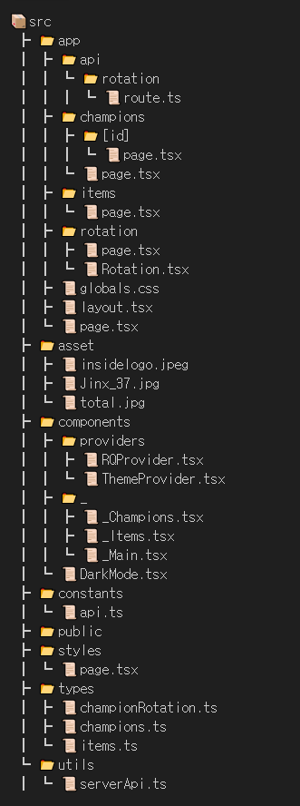

# **League of Legends 정보 웹 사이트**

</br>

## 📖 목차

- [**League of Legends 정보 웹 사이트**](#league-of-legends-정보-웹-사이트)
  - [📖 목차](#-목차)
  - [👨‍🏫 프로젝트 소개](#-프로젝트-소개)
  - [🚑 주요기능](#-주요기능)
  - [⏲️ 개발기간](#️-개발기간)
  - [📚️ 기술스택](#️-기술스택)
  - [🌏 디랙토리](#-디랙토리)
  - [💥 트러블슈팅](#-트러블슈팅)

</br>

## 👨‍🏫 프로젝트 소개

LOL 게임 캐릭터와 아이템을 소개하는 웹 사이트 </br>
게임 캐릭터와 사용할 수 있는 아이템, 금주 무료로 체험할 수 있는 로테이션 게임 캐릭터까지 확인해 볼 수 있는 LOL 정보 웹 사이트입니다.

</br>

## 🚑 주요기능

1. **챔피언 페이지**

   - 게임 캐릭터에 대한 정보를 확인할 수 있는 페이지

2. **아이템 페이지**

   - 게임에서 사용 가능한 아이템들을 확인할 수 있는 페이지

3. **로테이션 페이지**
   - 이번주에 무료로 사용 가능한 게임 캐릭터를 알려주는 페이지

</br>

## ⏲️ 개발기간

- 2024.12.09 ~ 2024.12.19

</br> 
 
## 📚️ 기술스택

<div>
    
    
    
    
    
    
</div>

</br>

## 🌏 디랙토리



## 💥 트러블슈팅

- 문제 1 : `fetchChampionsDetail` 함수 타입오류가 계속 남
- 해결 방안 :  

```
export const fetchChampionsDetail = async (
  id: string
): Promise<Champion> => {
  try {
    const latestVersion = await fetchVersion();

    // 챔피언 상세정보 api
    const championDetailRes = await fetch(
      `${BASE_URL}/cdn/${latestVersion}/data/ko_KR/champion/${id}.json`
    );
    if (!championDetailRes)
      throw new Error("챔피언 목록을 불러오는데 실패했습니다");

    const championDetailData = await championDetailRes.json();
    return championDetailData;
    } catch (error) {
    console.error("championDetailData api호출 실패", error);
    throw new Error("챔피언 상세 정보를 가져오지 못했습니다");
     }
    };
```
 

`export const fetchChampionsDetail = async ( id: string ): Promise<Champion> => {`
 
<br>  

챔피언디테일 페이지인데 챔피언목록 페이지 타입을 정의해주고 있어서 타입 오류가 남.

 <br>  

```
export interface ChampionDetail {
  data: {
    [key: string]: {
      name: string;
      title: string;
      info: ChampionInfo;
      blurb: string;
      image: ChampionImage;
    };
  };
}
```
<br>  

이런식으로 챔피언디테일 타입을 지정해주면 타입 오류가 안난다. 

<br>  

---
<br>  

- 문제 2 : 챔피언 데이터의 id값을 받아서 map 메서드를 사용해야하는데 데이터가 3중으로 싸인 객체 형태로 받아와지는 문제 발생
- 해결 방안 : 


```
// champions 데이터

{
  type: 'champion',
  format: 'standAloneComplex',
  version: '14.24.1',
  data: {
    Aatrox: {
      id: 'Aatrox',
      key: '266',
      name: '아트록스',
      title: '다르킨의 검',
      image: [Object],
      skins: [Array],
      lore: '한때는 ... 복수를...',       
      allytips: [Array],
      enemytips: [Array],
      tags: [Array],
      partype: '피의 샘',
      info: [Object],
      stats: [Object],
      spells: [Array],
      passive: [Object],
      recommended: []
    }
  }
}
```
<br>

내가 필요한 데이터는 champions.data.Aatrox.id 이다. 

<br>

```
const championsRes = await fetch(
      `${BASE_URL}/cdn/${latestVersion}/data/ko_KR/champion.json`,
      {
        next: {
          revalidate: 86400, 
        },
      }
    );
    if (!championsRes.ok || !championsRes)
      throw new Error("챔피언 목록을 불러오는데 실패했습니다");

    const championData = await championsRes.json();
    const hero = Object.values(championData.data) as Champion[];
```
<br>

내가 필요한 키 값만 선택해서 데이터를 받고 그걸 다시 Object.values 메서드를 사용해서 배열 형태로 바꿔줌

<br>  

---
<br>  


- 문제점 3 : 배열 형태인 데이터를 받아왔는데 id값을 뽑아내는 방법을 모르겠음
- 해결 방안 :


```
const obj = { name: "Aatrox", age: 30 };

console.log(obj["name"]); // "Aatrox"
```
<br>

객체안에 객체 형태인 상태에서 그 밸류값을 꺼내오기 위해선 대괄호 표기법으로 접근해야한다. 

<br>

```
export default async function ChampionDetailPage({
  params,
}: ChampionPageProps) {
  const { id } = params;
  const championDetail = await fetchChampionsDetail(id);

  const latestVersion = await fetchVersion();

  return (
    <div>
      <div className="min-h-screen text-white flex flex-col items-center py-10 px-5 relative">
        <Image
          src={`${BASE_URL}/cdn/img/champion/splash/${[id]}_0.jpg`}
          alt="Champion Splash"
          fill
          className="object-cover brightness-50"
        />

        <div className="p-6 max-w-6xl w-full z-10">
          <div className="flex flex-col items-center">
            <h1 className="text-5xl mb-4 text-subColor1 font-bold [text-shadow:_2px_2px_0_black]">
              {championDetail[id].name}
            </h1>
            <h2 className="text-3xl mb-5 text-subColor1 [text-shadow:_2px_2px_0_black]">
              {championDetail[id].title}
            </h2>
            <Image
              src={`${BASE_URL}/cdn/${latestVersion}/img/champion/${championDetail[id].image.full}`}
              alt={championDetail[id].name}
              width={150}
              height={150}
            />
            <p className="mt-5 text-lg leading-relaxed text-gray-300 text-center">
              {championDetail[id].blurb}
            </p>
          </div>
          <ul className="flex gap-8 justify-center mt-10 text-2xl text-subColor1 [text-shadow:_2px_2px_0_black]">
            <li>
              공격: <span>{championDetail[id].info.attack}</span>
            </li>
            <li>
              방어: <span>{championDetail[id].info.defense}</span>
            </li>
            <li>
              마법: <span>{championDetail[id].info.magic}</span>
            </li>
            <li>
              난이도: <span>{championDetail[id].info.difficulty}</span>
            </li>
           </ul>
          </div>
        </div>
      </div>
    </div>
  );
}

```
<br>

`championDetail`이  `Object.values(championData.data)`이기 때문에 그 안에 있는 `id` 값을 가져오기 위해 `championDetail[id]` 이런 식으로 데이터에 접근하면 된다.  

<br>

